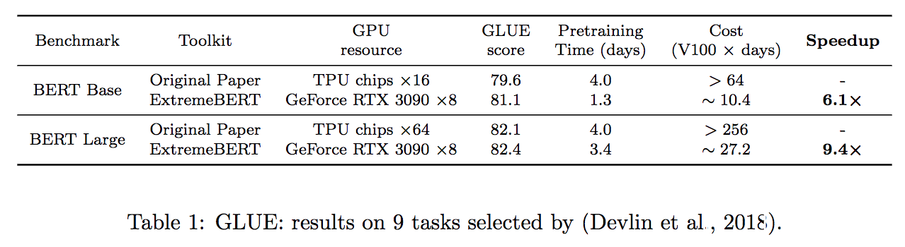

# ExtremeBERT: Accelerate your LM Pre-training!

ExtremeBERT is a toolkit that accelerates the pretraining and finetuning of BERT on customized datasets.
Take a quick look at our [documentation](https://extreme-bert.github.io/extreme-bert-page) and [paper](https://arxiv.org/abs/2211.17201).

<p align="center">

</p>

<p align="center">
    <a href="https://github.com/extreme-bert/extreme-bert/blob/main/LICENSE">
        
    </a>
    <a href="https://extreme-bert.github.io/extreme-bert-page">
        
    </a>
    <a href="https://github.com/extreme-bert/extreme-bert/blob/main/CODE_OF_CONDUCT.md">
        
    </a>
</p>

## Features 
### Simple Installation
We simplify the installation process of dependencies required by the package. They can be easily installed by a single command `source install.sh`. 
No other steps are needed! 

### Fast Training
Pretraining time can be reduced to a time-based value by defining `--total_training_time=24.0` (24 hours for example).
Mixed precision is supported by adding `--fp16`. 



### Dataset Zoo 
Support a large number of pre-training datasets. Users can easily use them via
[huggingface dataset hub](https://huggingface.co/datasets).
In addition, we also support users' custom dataset.


### Optimization-friendly
It is hard to verify the effectiveness of a new optimization method in LM pre-training. With our package, we support integration of customized optimizers and schedulers into the pipeline, which help researchers in the optimization community to easily verify their algorithms. 
Efficient optimization and data processing algorithms will also be added to future releases.


### Supported Models

| Model   |   Status |
|----------|:-------------:|
| [BERT](https://arxiv.org/abs/1810.04805) |  :white_check_mark: Supported |
| [RoBERTa](https://arxiv.org/abs/1907.11692), [ALBERT](https://arxiv.org/abs/1909.11942), [DeBERTa](https://arxiv.org/abs/2006.03654) |  :construction: Developing |

## System requirements
* Linux Ubuntu >= 18.04.
* At least 20 GB GPU memory, e.g. GPU 3090 x1, or 2080Ti GPU x2, GeForce RTX 3070 x4, etc.
* At least 200GB disk space.

## Configurable pipeline
  First, one may refer to `configs/bert-simple.yaml` and make suitable configs for the pipeline, including datasets, number of gpus available, etc. Then, by simply running the following command, the whole pipeline will be executed stage by stage,
  ```bash
  source install.sh; python main.py --config configs/bert-simple.yaml
  ```
  which will run environment installation, dataset prepration, pretraining, finetuning and test result collection one by one and generate the .zip file for [GLUE test server submission](https://gluebenchmark.com/submit) under `output_test_translated/finetune/*/*.zip`.
   Please refer to [PIPELINE_CONFIG.md](docs/PIPELINE_CONFIG.md) for more information about the YAML config file.

   The details of each stages are illustrated in following sections.

## Installation
run `source install.sh`

## Dataset
The [`dataset`](dataset/) directory includes scripts to pre-process the datasets we used in our experiments (Wikipedia, Bookcorpus). See dedicated [README](dataset/README.md) for full details.

## Pretraining

Pretraining script: `run_pretraining.py`

For all possible pretraining arguments see: `python run_pretraining.py -h`

Example for training (24-layers/1024H/time-based learning rate schedule):

```bash
deepspeed run_pretraining.py \
  --model_type bert-mlm \ --tokenizer_name bert-large-uncased \
  --hidden_act gelu \
  --hidden_size 1024 \
  --num_hidden_layers 24 \
  --num_attention_heads 16 \
  --intermediate_size 4096 \
  --hidden_dropout_prob 0.1 \
  --attention_probs_dropout_prob 0.1 \
  --encoder_ln_mode pre-ln \
  --lr 1e-3 \
  --train_batch_size 4096 \
  --train_micro_batch_size_per_gpu 32 \
  --lr_schedule time \
  --curve linear \
  --warmup_proportion 0.06 \
  --gradient_clipping 0.0 \
  --optimizer_type adamw \
  --weight_decay 0.01 \
  --adam_beta1 0.9 \
  --adam_beta2 0.98 \
  --adam_eps 1e-6 \
  --total_training_time 24.0 \
  --early_exit_time_marker 24.0 \
  --dataset_path <dataset path> \
  --output_dir <output path> \
  --print_steps 100 \
  --num_epochs_between_checkpoints 10000 \
  --job_name pretraining_experiment \
  --project_name budget-bert-pretraining \
  --validation_epochs 3 \
  --validation_epochs_begin 1 \
  --validation_epochs_end 1 \
  --validation_begin_proportion 0.05 \
  --validation_end_proportion 0.01 \
  --validation_micro_batch 16 \
  --deepspeed \
  --data_loader_type dist \
  --do_validation \
  --use_early_stopping \
  --early_stop_time 180 \
  --early_stop_eval_loss 6 \
  --seed 42 \
  --fp16
```

Also if you want to pretrain the bert module with the ngram_attention_module, you can add the ngram argument as follows:

```bash
deepspeed run_pretraining.py \
  --model_type bert-mlm \
  --tokenizer_name bert-large-uncased \
  --hidden_act gelu \
  --hidden_size 1024 \
  --num_hidden_layers 24 \
  --num_attention_heads 16 \
  --intermediate_size 4096 \
  --hidden_dropout_prob 0.1 \
  --attention_probs_dropout_prob 0.1 \
  --encoder_ln_mode pre-ln \
  --lr 1e-3 \
  --train_batch_size 4096 \
  --train_micro_batch_size_per_gpu 32 \
  --lr_schedule time \
  --curve linear \
  --warmup_proportion 0.06 \
  --gradient_clipping 0.0 \
  --optimizer_type adamw \
  --weight_decay 0.01 \
  --adam_beta1 0.9 \
  --adam_beta2 0.98 \
  --adam_eps 1e-6 \
  --total_training_time 24.0 \
  --early_exit_time_marker 24.0 \
  --dataset_path <dataset path> \
  --output_dir <output path> \
  --print_steps 100 \
  --num_epochs_between_checkpoints 10000 \
  --job_name pretraining_experiment \
  --project_name budget-bert-pretraining \
  --validation_epochs 3 \
  --validation_epochs_begin 1 \
  --validation_epochs_end 1 \
  --validation_begin_proportion 0.05 \
  --validation_end_proportion 0.01 \
  --validation_micro_batch 16 \
  --deepspeed \
  --data_loader_type dist \
  --do_validation \
  --use_early_stopping \
  --early_stop_time 180 \
  --early_stop_eval_loss 6 \
  --seed 42 \
  --fp16 \
  --is_Ngram 1 \
  --Ngram_path <ngram path> \
  --fasttext_model_path <fasttext_model_path>
```
pay attention to the fact that the embedding dimension of the bert which means `hidden_size` should be the same with the fasttext initialization dimension if you want to use fasttext to initialize.

Also you can pretraining the roberta model by running the following command:

```bash
deepspeed run_pretraining.py \
  --model_type roberta-mlm-TDNA \
  --tokenizer_name roberta-base \
  --hidden_act gelu \
  --hidden_size 768 \
  --vocab_size 50265 \
  --num_hidden_layers 12 \
  --num_attention_heads 12 \
  --intermediate_size 3072 \
  --hidden_dropout_prob 0.1 \
  --attention_probs_dropout_prob 0.1 \
  --lr 1e-3 \
  --train_batch_size 4096 \
  --train_micro_batch_size_per_gpu 32 \
  --lr_schedule time \
  --curve linear \
  --warmup_proportion 0.06 \
  --gradient_clipping 0.0 \
  --optimizer_type adamw \
  --weight_decay 0.01 \
  --adam_beta1 0.9 \
  --adam_beta2 0.98 \
  --adam_eps 1e-6 \
  --total_training_time 24.0 \
  --early_exit_time_marker 24.0 \
  --dataset_path <dataset path> \
  --output_dir <output path> \
  --print_steps 100 \
  --num_epochs_between_checkpoints 10000 \
  --job_name pretraining_experiment \
  --project_name budget-roberta-pretraining \
  --validation_epochs 3 \
  --validation_epochs_begin 1 \
  --validation_epochs_end 1 \
  --validation_begin_proportion 0.05 \
  --validation_end_proportion 0.01 \
  --validation_micro_batch 16 \
  --deepspeed \
  --data_loader_type dist \
  --do_validation \
  --use_early_stopping \
  --early_stop_time 180 \
  --early_stop_eval_loss 6 \
  --seed 42 \
  --fp16 \
  --is_Ngram 1 \
  --Ngram_path <ngram path> \
  --fasttext_model_path <fasttext_model_path>
```
Please note that the vocab_size should be the same with the vocab_size of the tokenizer that we use in the data processing period. We can use the pretrained model at the output_dir

## Finetuning

We can use the model from huggingface library or the model from the pretrained model, then we fine tune the model on the target dataset.

Example for fine tune a roberta for glue dataset.

```bash
python run_classification.py \
    --is_Ngram 0 \
    --model-type roberta \
    --model_name_or_path roberta-base or <pretrained model dir>\
    --task_name <task name>  \
    --max_seq_length 256 \
    --per_device_train_batch_size 16 \
    --learning_rate 4e-5 \
    --num_train_epochs 3.0 \
    --output_dir <output dir of fine-tuned model> \
    --data_dir <data dir of the task> 
```
If you want to fine tune with the ngram module, just set the `is_Ngram` 1, and provide a Ngram_path.

```bash
python run_classification.py \
    --is_Ngram 1 \
    --model-type roberta \
    --model_name_or_path roberta-base or <pretrained model dir>\
    --task_name <task name>  \
    --max_seq_length 256 \
    --per_device_train_batch_size 16 \
    --learning_rate 4e-5 \
    --num_train_epochs 3.0 \
    --output_dir <output dir of fine-tuned model> \
    --data_dir <data dir of the task> \
    --Ngram_path <ngram dir> \
    --fasttext_model_path <fasttext dir>
```
The fine tuned model was stored at output_dir.

The same is the bert model,If you want to fine tune a bert model for the glue dataset, you can run the following command.

```bash
python run_classification.py \
    --is_Ngram 0 \
    --model-type bert \
    --model_name_or_path bert-base-uncased or <pretrained model dir>\
    --task_name <task name>  \
    --max_seq_length 256 \
    --per_device_train_batch_size 16 \
    --learning_rate 4e-5 \
    --num_train_epochs 3.0 \
    --output_dir <output dir of fine-tuned model> \
    --data_dir <data dir of the task> 
```
If you want fine tune the bert with ngram module:

```bash
python run_classification.py \
    --is_Ngram 1 \
    --model-type bert \
    --model_name_or_path bert-base-uncased or <pretrained model dir>\
    --task_name <task name>  \
    --max_seq_length 256 \
    --per_device_train_batch_size 16 \
    --learning_rate 4e-5 \
    --num_train_epochs 3.0 \
    --output_dir <output dir of fine-tuned model> \
    --data_dir <data dir of the task> \
    --Ngram_path <ngram dir> \
    --fasttext_model_path <fasttext dir>
```

## TAPT
Following the [Don't Stop Pretraining ACL 2020 paper](https://github.com/allenai/dont-stop-pretraining), we can get a better performance by doing task adaptive pretraining.
If you want to pretrain a roberta model further on the task domain dataset with ngram module, you can run the following command.

```bash
python run_tapt.py  \
    --is_Ngram 1  \
    --model_name_or_path roberta-base \ --model_type roberta  \
    --fasttext_model_path  <fasttext dir>\
    --Ngram_path <ngram dir> \
    --train_data_file <train_data set> \
    --eval_data_file <eval_data set> \
    --output_dir <output dir of TAPT model> \
    --num_train_epochs 3
```
Also, extreme-bert allow you to pretrain a bert model too:

```bash
python run_tapt.py  \
    --is_Ngram 1  \
    --model_name_or_path bert-base-uncased \ --model_type bert  \
    --fasttext_model_path  <fasttext dir>\
    --Ngram_path <ngram dir> \
    --train_data_file <train_data set> \
    --eval_data_file <eval_data set> \
    --output_dir <output dir of TAPT model> \
    --num_train_epochs 3
```
If you want to pretrain a roberta model without ngram module, just set the `is_Ngram` to 0.

```bash
python run_tapt.py  \
    --is_Ngram 0  \
    --model_name_or_path roberta-base \ --model_type roberta  \
    --train_data_file <train_data set> \
    --eval_data_file <eval_data set> \
    --output_dir <output dir of TAPT model> \
    --num_train_epochs 3
```
The same is the bert model without ngram module.

```bash
python run_tapt.py  \
    --is_Ngram 0  \
    --model_name_or_path bert-base-uncased \ --model_type bert  \
    --train_data_file <train_data set> \
    --eval_data_file <eval_data set> \
    --output_dir <output dir of TAPT model> \
    --num_train_epochs 3
```

## Citation
If you find this repository useful, you may cite [our paper](https://arxiv.org/abs/2211.17201) as:  
```
@inproceedings{extreme-bert,
    title={ExtremeBERT: A Toolkit for Accelerating Pretraining of Customized BERT}, 
    author={Rui Pan and Shizhe Diao and Jianlin Chen and Tong Zhang},
    year={2022},
    eprint={2211.17201},
    archivePrefix={arXiv},
    primaryClass={cs.CL},
    url={https://arxiv.org/abs/2211.17201},
}
```

## Acknowledgements
A significant portion of the code is based on [How to Train BERT with an Academic Budget](https://aclanthology.org/2021.emnlp-main.831.pdf) licensed under Apache 2.0. 

## Contact
For help or issues using this package, please submit a GitHub issue.

For personal communication related to this package, please contact Rui Pan (rpan@connect.ust.hk) and Shizhe Diao (sdiaoaa@connect.ust.hk).
